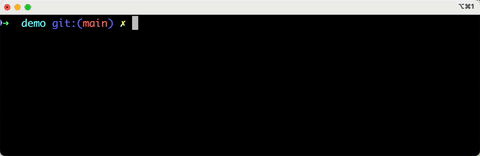

# @socketregistry

[](https://github.com/SocketDev/socket-registry-js/actions/workflows/test.yml)
[](https://twitter.com/SocketSecurity)

> A collection of [Socket.dev](https://socket.dev/) optimize package overrides
> for use with [`@socketsecurity/cli`](https://docs.socket.dev/docs/socket-cli).



## About

Inspired by [e18e](https://e18e.dev/), these overrides focus on:

- Cleanup ✨ — Reduce dependencies and replace polyfills with built-in
  equivalents.
- Levelup 🧩 — Add new features and leverage modern platform APIs.
- Speedup ⚡ — Boost performance to run faster.
- Tuneup 🔧 — Address CVEs, especially in outdated or unmaintained packages.

Overrides:

- Maintain compatibility by passing original package tests 💯
- Work seamlessly with CommonJS
- Retain original licenses and are MIT compatible
- Include
  <a href="https://www.typescriptlang.org/"></a>
  TypeScript definitions
- Support current and [LTS](https://nodejs.org/en/about/previous-releases) Node
  versions

## Contribute

Adding a new override is simple.

- Initialize the repository with your favorite package manager, e.g.
  `npm install`.
- Run

```bash
npm run make:npm-package [<package-name>]
```

- Follow the prompts to create the scaffolding for your shiny new override.
- Fill in all `TODO:` commented sections.
- Commit and send a pull request!
